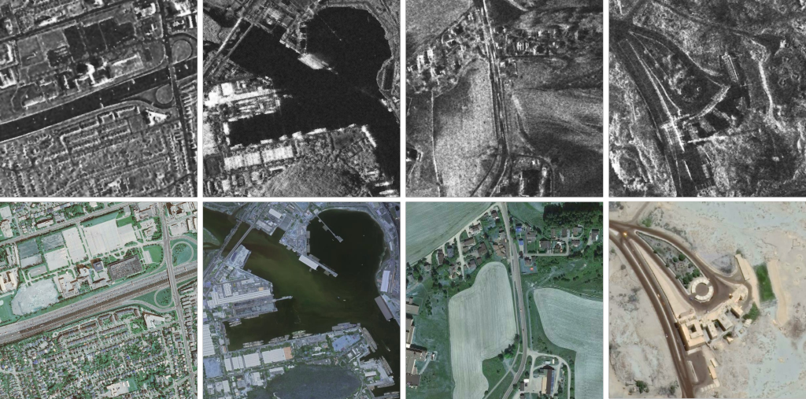
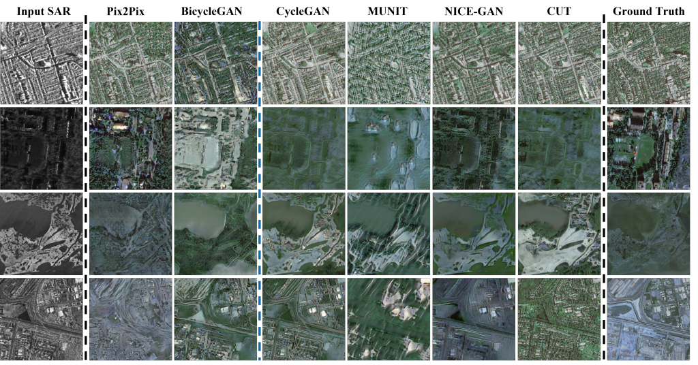

# SAR2Opt-Heterogeneous-Dataset


This is an overview of our proposed heterogeneous remote sensing images "SAR2Opt" dataset.  

SAR2Opt dataset can be used as a benchmark in __change detection__ and __image translation__ on remote sensing images.

  


## Description of dataset
We manually selected ground points on each pair of SAR-optical images to perform fine registration. All the pathces were cropped in size of 600*600 pixels after registration. If you want to use a pre-trained model, you could resize the patches first.

## Dataset
You can get the dataset from:  
- [Google Drive](https://drive.google.com/file/d/1XB9pWq-tVdxQsbVALxbYIF0Em90J4kkR/view?usp=sharing)  
- [BaiduDisk](https://pan.baidu.com/s/1xQ1nc2aPFdJ99SI2upl5Tg) (hy8d)


## Image-to-image translation results on __SAR2Opt dataset__
Here are some translated results on our SAR2Opt dataset with well-known GAN-based methods, which have been included in our GRSL paper.




## Usage of codes
_We slightly modofied the original codes to make our dataset suitable for the models. And we are grateful to the authors who have shared their codes kindly._

### **Pix2Pix**  
- train Pix2Pix: 
```
python train.py --dataroot ./datasets/combined_sar2opt --name sar2opt_pix2pix --model pix2pix --direction AtoB
```  
- test Pix2Pix:
```
python test.py --dataroot ./datasets/combined_sar2opt --name sar2opt_pix2pix --model pix2pix --direction AtoB
```

### **BicycleGAN**
- train BicycleGAN:
```
bash ./scripts/train_scripts/train_combined_sar2opt.sh
```
- test BicycleGAN:
```
bash ./scripts/test_scripts/test_combined_sar2opt.sh
```

### **CycleGAN**
- train CycleGAN:
```
python test.py --dataroot ./datasets/sar2opt --name sar2opt_cyclegan --model cycle_gan
```
- test CycleGAN:
```
python test.py --dataroot ./datasets/sar2opt --name sar2opt_cyclegan --model cycle_gan
```

### **MUNIT**
- train MUNIT:
```
python train.py --config configs/sar2opt_folder.yaml
```
- test MUNIT:
```
python test.py --config configs/sar2opt_folder.yaml \
               --input_folder datasets/sar2opt/testA/ \
               --output_folder results/sar2opt/images/ \
               --checkpoint outputs/sar2opt_folder/checkpoint/YOUR_MODEL.pt \
               --a2b 1 
```

### **NICE-GAN**
- train NICE-GAN:
```
python main.py --dataset sar2opt
```
- test NICE-GAN:
```
python main.py --dataset sar2opt --phase test
```

### **CUT**
- train CUT:
```
python train.py --dataroot ./datasets/sar2opt --name sar2opt_CUT --CUT_mode CUT
```
- test CUT:
```
 python test.py --dataroot ./datasets/sar2opt --name sar2opt_CUT --model cut
```

### **Attn-CycleGAN (ASGIT)**
- train BicycleGAN:
```
bash my_scripts/train_asgit_v2.sh
```
- test BicycleGAN:
```
bash my_scripts/test_asgit_v2.sh
```


  
#### Baselines we referenced here are:
- [Pix2Pix](https://github.com/junyanz/pytorch-CycleGAN-and-pix2pix)
- [BicycleGAN](https://github.com/junyanz/BicycleGAN)
- [CycleGAN](https://github.com/junyanz/pytorch-CycleGAN-and-pix2pix)
- [MUNIT](https://github.com/NVlabs/MUNIT)
- [NICE-GAN](https://github.com/alpc91/NICE-GAN-pytorch)
- [CUT](https://github.com/taesungp/contrastive-unpaired-translation)  
- [Attn-CycleGAN]()


## Citation
__If you find this dataset valuable in your projects, please cite our paper below:__

```
@article{zhao2022comparative,
  title={A Comparative Analysis of GAN-based Methods for SAR-to-Optical Image Translation},
  author={Zhao, Yitao and Celik, Turgay and Liu, Nanqing and Li, Heng-Chao},
  journal={IEEE Geoscience and Remote Sensing Letters},
  year={2022},
  publisher={IEEE}
}
```
